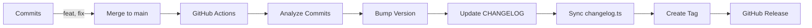

# 💰 Dólar Gaucho

<div align="center">


**Plataforma profesional de cotizaciones del dólar en Argentina con análisis AI**

[Demo](http://localhost:3000/demo) · [Documentación](./docs) · [Reportar Bug](https://github.com/yourusername/dolargaucho/issues)

</div>

---

## 📋 Índice

- [Características](#-características)
- [Tech Stack](#-tech-stack)
- [Inicio Rápido](#-inicio-rápido)
- [Estructura del Proyecto](#-estructura-del-proyecto)
- [Documentación](#-documentación)
- [Scripts Disponibles](#-scripts-disponibles)
- [Variables de Entorno](#-variables-de-entorno)
- [Conventional Commits](#-conventional-commits)
- [Releases Automáticos](#-releases-automáticos)
- [Roadmap](#-roadmap)

---

## ✨ Características

### 🎯 Cotizaciones en Tiempo Real

- ✅ Actualización automática cada 30 segundos
- ✅ Múltiples tipos de dólar (Oficial, Blue, MEP, CCL, Tarjeta, Cripto)
- ✅ Datos de inflación e índices económicos
- ✅ Riesgo país

### 📊 Visualización de Datos

- ✅ Gráficos interactivos con Recharts
- ✅ Comparativas históricas
- ✅ Dashboard personalizable
- ✅ Responsive design

### 🤖 AI-Powered (En desarrollo)

- 🚧 Análisis de noticias con OpenAI GPT-4
- 🚧 Correlación noticias-cotizaciones
- 🚧 Recomendaciones automáticas
- 🚧 Sentiment analysis

### 🧮 Calculadoras Financieras

- ✅ Calculadora de inflación
- ✅ Conversor de monedas
- ✅ Conversor cripto
- ✅ Análisis de IPC/IPM

### 📄 Sistema de Documentos (En desarrollo)

- 🚧 Biblioteca de PDFs profesionales
- 🚧 Informes económicos
- 🚧 Análisis de mercado
- 🚧 Sistema de descarga y visualización

---

## 🛠 Tech Stack

### Core

- **Framework:** Next.js 15.1.6 (Pages Router)
- **UI Library:** React 19
- **Language:** TypeScript 5
- **Styling:** Tailwind CSS 3.4 + CVA (Class Variance Authority)

### Data Fetching & State

- **Query Management:** TanStack Query (React Query) v5
- **HTTP Client:** Fetch API
- **Caching:** Smart caching with auto-refresh

### UI Components

- **Charts:** Recharts + Chart.js
- **Icons:** React Icons
- **Animations:** Framer Motion
- **Forms:** EmailJS

### Backend & Storage

- **Database:** Supabase
- **AI:** OpenAI GPT-4 (planned)
- **Email:** EmailJS

### Development

- **Linting:** ESLint
- **Package Manager:** npm
- **Version Control:** Git

---

## 🚀 Inicio Rápido

### Prerrequisitos

```bash
node >= 18.0.0
npm >= 9.0.0
```

### Instalación

1. **Clonar el repositorio**

```bash
git clone https://github.com/yourusername/dolargaucho-retro.git
cd dolargaucho-retro
```

2. **Instalar dependencias**

```bash
npm install
```

3. **Configurar variables de entorno**

```bash
cp .env.example .env.local
```

Edita `.env.local` con tus credenciales:

- Supabase (URL y keys)
- OpenAI API key (opcional, para AI features)
- EmailJS (para formulario de contacto)

4. **Iniciar servidor de desarrollo**

```bash
npm run dev
```

5. **Abrir en el navegador**

```
http://localhost:3000
```

### Demo de Componentes

Visita `/demo` para ver todos los componentes UI en acción:

```
http://localhost:3000/demo
```

---

## 📁 Estructura del Proyecto

```
dolargaucho-retro/
├── app/
│   └── providers.tsx          # React Query Provider
├── components/
│   ├── ui/                    # Componentes base reutilizables
│   │   ├── Button/           # Button con CVA
│   │   └── Card/             # Card con Compound Components
│   ├── features/             # Componentes por feature
│   │   ├── charts/          # Gráficos (Recharts)
│   │   ├── calculadoras/    # Calculadoras financieras
│   │   └── news/            # Noticias (próximamente)
│   └── DolarDashboard.tsx   # Dashboard principal
├── hooks/
│   ├── useDolarQuery.ts     # TanStack Query hook
│   └── useDolar.ts          # Legacy hook (backward compatible)
├── lib/
│   ├── config/              # Configuración centralizada
│   │   └── api.ts          # API endpoints
│   ├── utils/               # Utilidades
│   │   └── cn.ts           # Class names utility
│   └── supabase.ts         # Supabase client
├── pages/
│   ├── index.tsx           # Home page
│   ├── demo.tsx            # Demo de componentes
│   ├── _app.tsx            # App wrapper con Providers
│   └── api/                # API routes
├── types/
│   └── api/                # Type definitions
│       └── dolar.ts        # Tipos de DolarAPI
├── docs/
│   ├── architecture/       # Documentación de arquitectura
│   ├── guides/             # Guías paso a paso
│   └── examples/           # Ejemplos de código
├── styles/
│   └── globals.css         # Estilos globales
└── public/                 # Assets estáticos
```

---

## 📚 Documentación

### Guías Principales

- **[Arquitectura Profesional](./docs/architecture/ARQUITECTURA_PROFESIONAL.md)** - Diseño completo del sistema
- **[Guía de Implementación](./docs/guides/GUIA_IMPLEMENTACION.md)** - Cómo implementar features
- **[Implementación Completada](./docs/guides/IMPLEMENTACION_COMPLETADA.md)** - Estado actual del proyecto

### Ejemplos de Código

- **[Componentes CVA](./docs/examples/01-cva-components.tsx)** - Button, Card, Input con variantes
- **[TanStack Query](./docs/examples/02-tanstack-query.tsx)** - Data fetching profesional
- **[AI Integration](./docs/examples/03-ai-news-integration.ts)** - Análisis de noticias con AI

### APIs Utilizadas

- **[DolarAPI.com](https://dolarapi.com/docs)** - Cotizaciones en tiempo real
- **[Argentina Datos](https://api.argentinadatos.com)** - Inflación y riesgo país

---

## 📜 Scripts Disponibles

```bash
# Desarrollo
npm run dev          # Inicia servidor de desarrollo

# Build
npm run build        # Crea build optimizado de producción
npm run start        # Inicia servidor de producción

# Calidad de Código
npm run lint         # Ejecuta ESLint
npm run lint:fix     # Ejecuta ESLint y corrige automáticamente
npm run format       # Formatea código con Prettier
npm run format:check # Verifica formato con Prettier
npm run type-check   # Verifica tipos TypeScript
npm run validate     # Ejecuta lint + format + type-check

# Testing
npm test             # Ejecuta tests con Jest
npm run test:watch   # Ejecuta tests en modo watch
npm run test:coverage # Genera reporte de cobertura

# Releases (Automático)
npm run release      # Ejecuta semantic-release (solo en CI)
npm run release:dry  # Simula release sin publicar
npm run commit       # Helper interactivo para commits convencionales
```

---

## 🔐 Variables de Entorno

Copia `.env.example` a `.env.local` y configura:

### Requeridas

```env
# Supabase (obligatorio)
NEXT_PUBLIC_SUPABASE_URL=your_url
NEXT_PUBLIC_SUPABASE_ANON_KEY=your_key
```

### Opcionales

```env
# OpenAI (para features de AI)
OPENAI_API_KEY=sk-...

# EmailJS (para contacto)
NEXT_PUBLIC_EMAILJS_SERVICE_ID=...
NEXT_PUBLIC_EMAILJS_TEMPLATE_ID=...
NEXT_PUBLIC_EMAILJS_PUBLIC_KEY=...

# NewsAPI (para noticias)
NEWS_API_KEY=...
```

Ver [.env.example](./.env.example) para lista completa.

---

## 📝 Conventional Commits

Este proyecto usa **Conventional Commits** para mensajes de commits estructurados.

### Formato

```
<tipo>(<scope>): <descripción>

[cuerpo opcional]

[footer opcional]
```

### Tipos Permitidos

| Tipo       | Descripción                                 | Version Bump              |
| ---------- | ------------------------------------------- | ------------------------- |
| `feat`     | Nueva funcionalidad                         | **MINOR** (1.5.0 → 1.6.0) |
| `fix`      | Corrección de bug                           | **PATCH** (1.5.0 → 1.5.1) |
| `perf`     | Mejora de performance                       | **PATCH**                 |
| `docs`     | Solo documentación                          | -                         |
| `style`    | Cambios de formato (espacios, punto y coma) | -                         |
| `refactor` | Refactorización de código                   | -                         |
| `test`     | Agregar o modificar tests                   | -                         |
| `build`    | Cambios en build system o dependencias      | -                         |
| `ci`       | Cambios en CI/CD                            | -                         |
| `chore`    | Tareas de mantenimiento                     | -                         |

### Breaking Changes

Para cambios que rompen compatibilidad (MAJOR version: 1.5.0 → 2.0.0):

```bash
# Opción 1: Usar !
feat!: cambio que rompe compatibilidad

# Opción 2: Footer BREAKING CHANGE
feat: nuevo sistema de auth

BREAKING CHANGE: La API de autenticación cambió completamente
```

### Ejemplos

```bash
# Feature (minor bump)
feat(crypto): add sparklines to favorites table

# Fix (patch bump)
fix(auth): correct token expiration logic

# Multiple líneas
feat(dashboard): redesign navbar with marquee

- Add DolarMarquee component
- Implement hamburger menu
- Add user dropdown

Closes #123

# Con scope
fix(api): handle null values in FRED data
docs(readme): update installation instructions
chore(deps): upgrade next to 15.1.6
```

### Helper Interactivo

Usá el helper interactivo para commits:

```bash
npm run commit
```

Esto abre un wizard que te guía paso a paso.

---

## 🚀 Releases Automáticos

Este proyecto usa **semantic-release** para automatizar completamente el proceso de releases.

### Cómo Funciona

1. **Hacés commits convencionales** (feat, fix, etc.)
2. **Mergeás a `main`**
3. **GitHub Actions se dispara automáticamente:**
   - Analiza commits desde el último release
   - Determina el tipo de versión (patch/minor/major)
   - Actualiza `package.json`
   - Genera `CHANGELOG.md`
   - Sincroniza `lib/changelog.ts` (para el modal WhatsNew)
   - Crea git tag
   - Crea GitHub Release
   - Publica release notes

### Flujo de Trabajo



### Ejemplo Práctico

```bash
# 1. Hacés commits convencionales
git commit -m "feat(crypto): add trading view widget"
git commit -m "fix(dashboard): correct chart tooltips"
git commit -m "docs: update API documentation"

# 2. Push a rama
git push origin feature/crypto-improvements

# 3. Creás PR y mergeás a main
# Título del PR: "feat: crypto improvements"

# 4. Automáticamente:
# ✅ Version bump: 1.5.0 → 1.6.0 (por el feat)
# ✅ CHANGELOG.md actualizado con:
#    - ✨ Nuevas Funcionalidades
#      - Add trading view widget
#    - 🐛 Correcciones
#      - Correct chart tooltips
# ✅ lib/changelog.ts sincronizado
# ✅ Tag v1.6.0 creado
# ✅ GitHub Release publicado

# 5. Modal WhatsNew se actualiza automáticamente
# Usuarios ven: "¡Versión 1.6.0 disponible!"
```

### Validación Local

Antes de mergear, podés simular el release:

```bash
npm run release:dry
```

Esto muestra qué versión se generaría sin publicar nada.

### Configuración

- **`.releaserc.js`** - Configuración de semantic-release
- **`commitlint.config.js`** - Validación de commits
- **`.github/workflows/release.yml`** - Workflow de CI/CD
- **`scripts/sync-changelog.js`** - Sincronización de changelog

### Notas Importantes

- Solo commits en `main` generan releases
- Commits con `[skip ci]` son ignorados
- `docs`, `chore`, `style` no generan releases
- PRs deben tener título en formato convencional

---

## 🎨 Componentes UI

### Button

```tsx
import { Button } from '@/components/ui/Button';

<Button variant="primary" size="md">Click me</Button>
<Button variant="outline" size="sm" isLoading>Loading</Button>
```

**Variantes:** `primary` | `secondary` | `outline` | `ghost` | `danger`
**Tamaños:** `xs` | `sm` | `md` | `lg` | `xl`

### Card

```tsx
import { Card } from '@/components/ui/Card';

<Card variant="elevated" padding="lg" hover="glow">
  <Card.Header>
    <Card.Title>Título</Card.Title>
    <Card.Description>Descripción</Card.Description>
  </Card.Header>
  <Card.Content>Contenido</Card.Content>
  <Card.Footer>
    <Button>Action</Button>
  </Card.Footer>
</Card>;
```

---

## 📊 Data Fetching

### Con TanStack Query

```tsx
import { useDolarQuery, useDolarByType } from '@/hooks/useDolarQuery';

function MyComponent() {
  const { data, isLoading, error } = useDolarQuery();

  if (isLoading) return <div>Cargando...</div>;
  if (error) return <div>Error: {error.message}</div>;

  return (
    <div>
      {data?.map((dolar) => (
        <div key={dolar.nombre}>
          {dolar.nombre}: ${dolar.venta}
        </div>
      ))}
    </div>
  );
}
```

**Features:**

- ✅ Auto-refresh cada 30 segundos
- ✅ Cache inteligente de 1 minuto
- ✅ 3 reintentos automáticos
- ✅ Deduplicación de requests
- ✅ DevTools para debugging

---

## 🗺️ Roadmap

### ✅ Fase 1: Fundamentos (Completada)

- [x] TanStack Query integration
- [x] CVA component system
- [x] Type-safe components
- [x] Auto-refresh data
- [x] Professional documentation

### 🚧 Fase 2: AI & News (En Progreso)

- [ ] OpenAI GPT-4 integration
- [ ] News scraping & analysis
- [ ] Sentiment analysis
- [ ] Impact predictions
- [ ] AI-powered recommendations

### 📋 Fase 3: Documents & Advanced Features

- [ ] PDF library with Supabase
- [ ] Document upload/download
- [ ] Professional reports
- [ ] Advanced charts
- [ ] Custom dashboards

### 🌟 Fase 4: Mobile & PWA

- [ ] Mobile app (React Native)
- [ ] PWA capabilities
- [ ] Push notifications
- [ ] Offline mode
- [ ] App Store deployment

### 🔮 Futuro

- [ ] Multi-region support (Chile, México, etc.)
- [ ] User accounts & portfolios
- [ ] Alert system
- [ ] API pública
- [ ] Plugin system

---

## 🤝 Contribuir

Las contribuciones son bienvenidas. Por favor:

1. Fork el proyecto
2. Crea tu feature branch (`git checkout -b feature/AmazingFeature`)
3. Commit tus cambios (`git commit -m 'Add some AmazingFeature'`)
4. Push al branch (`git push origin feature/AmazingFeature`)
5. Abre un Pull Request

---

## 📝 License

Este proyecto está bajo la licencia MIT. Ver [LICENSE](./LICENSE) para más información.

---

## 👨‍💻 Autor

**Tomás Maritano**

- LinkedIn: [Tu LinkedIn](https://linkedin.com/in/tu-perfil)
- GitHub: [@tuusername](https://github.com/tuusername)

---

## 🙏 Agradecimientos

- [DolarAPI.com](https://dolarapi.com) - API de cotizaciones
- [Argentina Datos](https://api.argentinadatos.com) - Datos económicos
- [Vercel](https://vercel.com) - Hosting
- [Supabase](https://supabase.com) - Backend as a Service
- [shadcn/ui](https://ui.shadcn.com) - Inspiración de componentes

---

## 📞 Soporte

¿Necesitas ayuda? Abre un [issue](https://github.com/yourusername/dolargaucho/issues) o contacta vía email.

---

<div align="center">

**⭐ Si te gusta el proyecto, dale una estrella en GitHub ⭐**

Hecho con ❤️ en Argentina 🇦🇷

</div>
