# Dólar Gaucho - Diagramas de Arquitectura

Esta documentación contiene los diagramas Mermaid que explican la arquitectura técnica de Dólar Gaucho.

---

## 1. Arquitectura General del Sistema

Este diagrama muestra la arquitectura completa del sistema, incluyendo:

- **Frontend**: Next.js 15.1.6 con Pages Router
- **State Management**: Zustand + TanStack Query
- **API Layer**: Next.js API Routes
- **Backend Services**: PostgreSQL, Vercel Edge, APIs externas


---

## 2. Sync Engine Flow - Cross-Device Synchronization

```mermaid
sequenceDiagram
    participant U as 🧑 User (Device A)
    participant UI as 💻 UI Component
    participant Store as 📦 Zustand Store
    participant Sync as 🔄 Sync Engine
    participant Queue as 📋 Sync Queue
    participant API as ⚡ API Route
    participant DB as 💾 PostgreSQL
    participant U2 as 👤 User (Device B)

    U->>UI: Clicks "Add to Favorites"
    UI->>Store: toggleFavorite("bitcoin")

    Store->>Store: Update local state
    Store->>UI: Re-render immediately ⚡
    UI->>U: Shows "Added" instantly

    Store->>Sync: syncToBackend()
    Sync->>Sync: Debounce 500ms ⏱️

    alt Happy Path - Sync Success
        Sync->>API: PUT /api/auth/favorites
        API->>DB: UPDATE user_preferences
        DB-->>API: ✅ Success
        API-->>Sync: 200 OK
        Sync->>Store: Update syncStatus: 'synced'
        Sync->>UI: Show sync indicator 🟢
    end

    alt Error Path - Network Failure
        Sync->>API: PUT /api/auth/favorites
        API--x Sync: ❌ 500 Error
        Sync->>Queue: Add to retry queue
        Queue->>Queue: Wait 1s (exponential backoff)
        Queue->>API: Retry attempt 1
        API--x Queue: ❌ Still failing
        Queue->>Queue: Wait 2s
        Queue->>API: Retry attempt 2
        API-->>Queue: ✅ Success!
        Queue->>Sync: Sync completed
        Sync->>Store: Update syncStatus: 'synced'
    end

    U2->>API: GET /api/auth/favorites
    API->>DB: SELECT * FROM user_preferences
    DB-->>API: Return latest data
    API-->>U2: ✅ Synced favorites

    Note over U,U2: 🎉 Cross-device sync complete!
```



---

## 3. Data Flow Architecture

```mermaid
graph LR
    subgraph "📡 External APIs"
        A1[DolarAPI]
        A2[CoinGecko]
        A3[FRED]
        A4[ECB]
    end

    subgraph "⚡ API Proxy"
        B1[/api/proxy/dolar]
        B2[/api/crypto]
        B3[/api/fred]
        B4[/api/ecb]
        B5[Cache 30s]
    end

    subgraph "🔄 TanStack Query"
        C1[useDolarQuery]
        C2[useCryptoQuery]
        C3[useFredData]
        C4[useECBRates]
        C5[Cache 5min]
    end

    subgraph "📦 Zustand"
        D1[Favorites]
        D2[Alerts]
        D3[Theme]
        D4[localStorage]
    end

    subgraph "🎨 UI Components"
        E1[DolaresTable]
        E2[CryptoTable]
        E3[FredChart]
        E4[ECBChart]
    end

    subgraph "💾 PostgreSQL"
        F1[(Preferences)]
        F2[(Favorites)]
    end

    A1 -->|HTTP| B1
    A2 -->|HTTP| B2
    A3 -->|HTTP| B3
    A4 -->|HTTP| B4

    B1 --> B5
    B2 --> B5
    B3 --> B5
    B4 --> B5

    B5 --> C1
    B5 --> C2
    B5 --> C3
    B5 --> C4

    C1 --> C5
    C2 --> C5
    C3 --> C5
    C4 --> C5

    C5 --> E1
    C5 --> E2
    C5 --> E3
    C5 --> E4

    D1 --> E1
    D1 --> E2
    D2 --> E3
    D3 --> E1

    D1 <--> D4
    D2 <--> D4

    F2 --> D1
    D1 -.Sync.-> F2

    style C5 fill:#10B981,stroke:#059669,stroke-width:3px,color:#fff
    style B5 fill:#F59E0B,stroke:#D97706,stroke-width:3px,color:#fff
    style D4 fill:#8B5CF6,stroke:#7C3AED,stroke-width:3px,color:#fff
```
